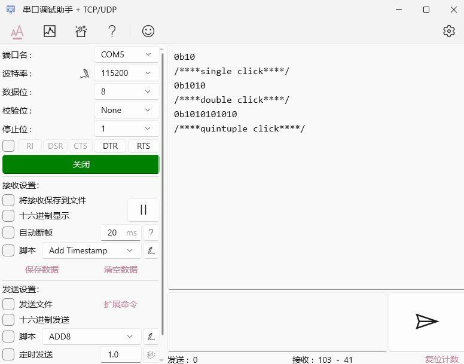

<h1 align="center">EmbeddedButton</h1>

<p align="center">
<a href="https://github.com/530china/EmbeddedButton/blob/master/LICENSE" target="blank">

</a>
<a href="https://github.com/530china/EmbeddedButton/stargazers" target="blank">

</a>
<a href="https://github.com/530china/EmbeddedButton/issues" target="blank">

</a>
<a href="https://github.com/530china/EmbeddedButton/pulls" target="blank">

</a>
</p>

 <p text-align="">
    <a href="./docs/README_zh-CN.md">[¼òÌåÖÐÎÄ]</a>
</p>

<h2>? Introduction</h2>
EmbeddedButton is a lightweight and easy-to-use embedded key driver module that allows for unlimited expansion of buttons;

- Supports multiple types of key events, including multi-tap, long press, short press followed by long press, and more£»
- The module implements the entire code logic based on a few simple principles;
- Core processing adopts a data-driven approach, supporting bitwise operations for key value matching. It only includes basic key value definitions internally, while other key values' meanings are defined by users through **configuring key value matching rules**, without the need to modify the code intrusively, providing great flexibility.£»

## ? Feature

> 1.Relying on just a few simple principles, it supports the entire logic for button judgment.
- As long as the key value is non-zero,tick++
- Whenever the button state changes, update the key value once£¨**__append_bit()**£©,and reset the tick(to ensure the tick represents the time of press or release)
- The length of the tick time and the button release are used as criteria to determine the end of a state, which enables good implementation of operations such as short press and long press.£»

> 2.Implemented in C language, it cleverly uses bitwise operations to represent each button's key value in binary form, where 1 indicates a press and 0 indicates a release.

key value | means
--- | ---
0b0 | Not pressing the button
0b010 | Single click
0b01010 | Double click
0b01010...n |  Repeat n click
0b011 | Long press start
0b0111| Long press hold
0b01110|Long press finish
0b01011|Single click then long press
0b0101011 | Double click then long press
0b01010..n11 | repeat n click then long press

> 3.Core processing adopts a data-driven approach, supporting bitwise operations for key value matching:
- Critical data structure: the key value matching rule configuration table:
```c
typedef struct {
    key_value_type_t operand;           // operand
    kv_match_operator_type_t operator;  // operator
    key_value_type_t tar_result;        // tar result
    void (*kv_func_cb)(void*);          // Callback functions called upon matching.
} key_value_match_map_t;

```
- Critical algorithms:
```c
key_value_type_t operand_origin = button->kv_match_map_ptr[i].operand;
key_value_type_t operand_result = button->kv_match_map_ptr[i].operand;
kv_match_operator_type_t operator =button->kv_match_map_ptr[i].operator;
key_value_type_t tar_result = button->kv_match_map_ptr[i].tar_result;

if(operator == KV_MATCH_OPERATOR_NULL)
    operand_result = button->key_value;
else if(operator & KV_MATCH_OPERATOR_BITWISE_AND)
    operand_result = (operand_origin & button->key_value);
else if(operator & KV_MATCH_OPERATOR_BITWISE_OR)
    operand_result = (operand_origin | button->key_value);
else if(operator & KV_MATCH_OPERATOR_BITWISE_NOT)
    operand_result = ~(button->key_value);
else if(operator & KV_MATCH_OPERATOR_BITWISE_XOR)
    operand_result = (operand_origin ^ button->key_value);

if(operand_result == tar_result)
{
    button->kv_match_map_ptr[i].kv_func_cb(button);
}
```

- Supported operators:
```c
#define KV_MATCH_OPERATOR_NULL             (0)      // null operator,only judge by(key_value == tar_result)?, this is default
#define KV_MATCH_OPERATOR_BITWISE_AND      (1 << 0) // Bitwise AND operator,(operand & key_value == tar_result)?
#define KV_MATCH_OPERATOR_BITWISE_OR       (1 << 1) // Bitwise OR operator,(operand | key_value == tar_result)?
#define KV_MATCH_OPERATOR_BITWISE_NOT      (1 << 2) // Bitwise NOT operator,(~ key_value == tar_result)?
#define KV_MATCH_OPERATOR_BITWISE_XOR      (1 << 2) // Bitwise XOR operator,(operand ^ key_value == tar_result)?
```

> 4.Designed based on an object-oriented approach, each button object is managed by its own instance of a data structure.

## ? Getting Started

### 1£©How to use
<details>
<summary>Click to expand/collapse C code</summary>

- Using the callback method as an example:
```c
// 1.Include header file
#include "embedded_button.h"

// 2.Define button entities
struct button_obj_t button1;

// 3.Configure the GPIO level read interface
uint8_t read_button_pin(uint8_t button_id)
{
    // you can share the GPIO read function with multiple Buttons
    switch(button_id)
    {
        case 0:
            return get_button1_value(); // User-implemented
            break;

        default:
            return 0;
            break;
    }

    return 0;
}

// 4. Configure key value matching rules (set up callback events)
void single_click_handle(void* btn)
{
    //do something...
    printf("/****single click****/\r\n");
}

void double_click_handle(void* btn)
{
    //do something...
    printf("/****double click****/\r\n");
}

void long_press_handle(void* btn)
{
    //do something...
    printf("/****long press****/\r\n");
}

void single_click_then_long_press_handle(void* btn)
{
    //do something...
    printf("/****single click and long press****/\r\n");
}

void quintuple_click_handle(void* btn)
{
    //do something...
    if(check_is_repeat_click_mode(btn))
        printf("/****quintuple click****/\r\n");
}

const key_value_match_map_t button1_map[] =
{
    {
        .tar_result = SINGLE_CLICK_KV,
        .kv_func_cb = single_click_handle
    },
    {
        .tar_result = DOUBLE_CLICK_KV,
        .kv_func_cb = double_click_handle
    },
    {
        .tar_result = LONG_PRESEE_START,
        .kv_func_cb = long_press_handle
    },
    {
        .tar_result = SINGLE_CLICK_THEN_LONG_PRESS_KV,
        .kv_func_cb = single_click_then_long_press_handle
    },
    {
        .operand = 0b1010101010,
        .operator = KV_MATCH_OPERATOR_BITWISE_AND,
        .tar_result = 0b1010101010,
        .kv_func_cb = quintuple_click_handle
    }
};
...

int main()
{
/************************************************
****5.Initialize button objects, where the parameter means:
****
****- Button entities
****- Bind the GPIO level read interface for the button**read_button1_pin()**
****- Set the effective trigger level"
****- Button ID
****- Key value matching rule configuration table
****- Size of Key value matching rule configuration table
*************************************************/
    button_init(&button1, read_button_pin, 0, 0, button1_map, ARRAY_SIZE(button1_map));
    // 6.Button start
    button_start(&button1);

    // 7. Set up a timer with a 5ms interval to periodically call the button background processing function **button_ticks()**
    __timer_start(button_ticks, 0, 5);

    while(1)
    {}
}
```

<br></details>

### 2£©Debug

<details>
<summary>Click to expand/collapse</summary>

- Defining the **EB_DEBUG_PRINTF** macro will enable key value printing, for example, as shown below, you need to replace printf with your own print function:
```c
#define EB_DEBUG_PRINTF printf
```

<br></details>

## ? Ohter
- This project was developed based on some issues I encountered with button drivers during my actual development work, drawing inspiration from another project (see reference link). Previously, I mentioned the advantages of this module. Now, let me discuss areas that need improvement: For representing combinations of multiple buttons, there is currently no elegant solution. I plan to refine this aspect when I have further ideas. Finally, I'd like to thank my colleague [shawnfeng0](https://github.com/shawnfeng0) for his help and thoughts, as well as anyone who is currently using this module. I welcome everyone to join in the development and improvement!
- ore advanced usage examples can be found in [examples](./examples/README.md)

## ? Reference links
- [MultiButton](https://github.com/0x1abin/MultiButton)
- [FlexibleButton](https://github.com/murphyzhao/FlexibleButton/tree/master)
- [armfly](https://www.armbbs.cn/forum.php?mod=viewthread&tid=111527&highlight=%B0%B4%BC%FC)
